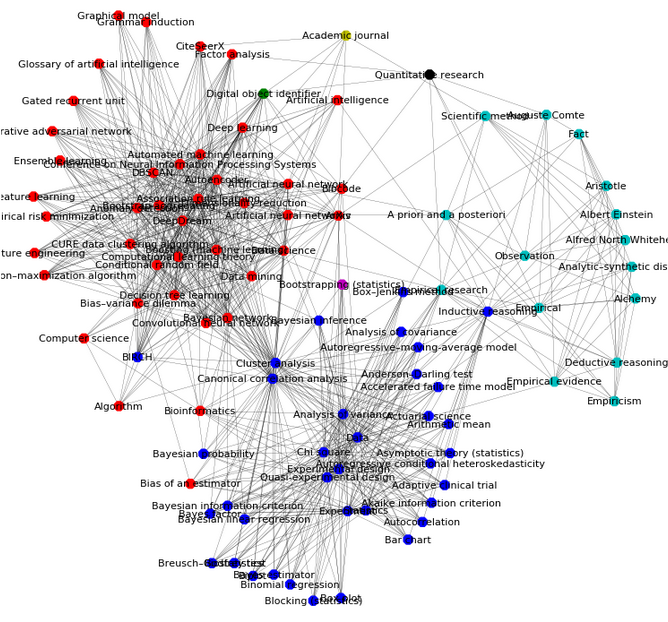

🇧🇷 mrs-wikipedia-ipynb
---

### Mineração de Redes Sociais: Wikipédia

<p align="center"></p>

As páginas de artigos da Wikipedia são conectadas por meio de hyperlinks (grafo direcionado), criando-se componentes conectados a partir de temáticas, referências, locais, geografia, idioma, cultura, entre outros aspectos. Este conteúdo é disponibilizado pela [API do MediaWiki](https://www.mediawiki.org/wiki/API), que permite um certo grau de interação com a plataforma da Wikipedia: extraindo sumário, conteúdo, relações de páginas, entre outros. Para obtermos este conteúdo neste IPython (Jupyter) notebook, utilizaremos dessa API por meio do pacote [wikipedia (PyPI)]( https://pypi.org/project/wikipedia/), e realizaremos algumas operações a fim de realizar uma análise descritivo-exploratória de sua rede:

* Instalar dependências
* Importar bibliotecas
* Definir funções e variáveis
* Variáveis de definição do usuário
  * *Pesquisar pelo título de artigos na Wikipedia*
* Conteúdo de uma página da Wikipedia
* Sumário de uma página específica da Wikipedia
* Construir uma rede de conexões entre páginas da Wikipedia
* Calcular suas medidas de centralidade de rede e modularidade
  * *Estatísticas por artigo (nó ou vértice)*
  * *Estatísticas considerando a rede inteira*
  * *Histograma de grau da rede*
* Plotar um grafo da rede após aplicar filtro k-core
  * *Grafo da rede filtrada atribuindo cores aos módulos*
  * *Outros algoritmos de distribuição para espacializar os nós da rede filtrada*
* Histograma de grau e subgrafo dos módulos identificados
* Determinar artigos de maior centralidade de grau por módulo
* Calcular os maiores módulos a partir da soma de suas centralidades
  * *Estatísticas gerais dos módulos*
* Normalizar os valores de centralidade dos módulos
* Scatter plot dos módulos a partir de suas centralidades normalizadas

No exemplo trabalhado, selecionamos uma página de artigo da Wikipédia -- "**[Data Science](https://en.wikipedia.org/wiki/Data_science)**" em inglês -- objetivando encontrar as suas conexões com outros mais artigos e verbetes na plataforma. A partir dos métodos expostos, fomos capazes de extrair os hyperlinks que conectam este tópico a outros mais relacionados ao artigo original. De posse destes dados, procuramos **1)** calcular as medidas de centralidade de cada nó/vertice/página, incluindo-se algumas não presentes por padrão na biblioteca ```networkx``` (*brokering* e *bridgeness*); **2)** identificar seus módulos a partir do algoritmo de modularidade disponível pela biblioteca ```community``` (método de Louvain); e **3)** distribuir a rede e espacializá-la visualmente. Baseando-se nestes resultados, calculamos também **4)** as estatísticas gerais por módulo e centralidades médias para o conjunto de módulos e **5)** suas correlações a partir das medidas de centralidade calculadas.

Este notebook objetivou demonstrar metodologicamente as técnicas e os conhecimentos adquiridos nas aulas de Mineração em Redes Sociais do Instituto Federal do Espírito Santo (Ifes), ministrado pelo prof. Dr. Sergio Nery Simões no curso de pós-graduação lato sensu em Ciência de Dados com Big Data (2018-19).
